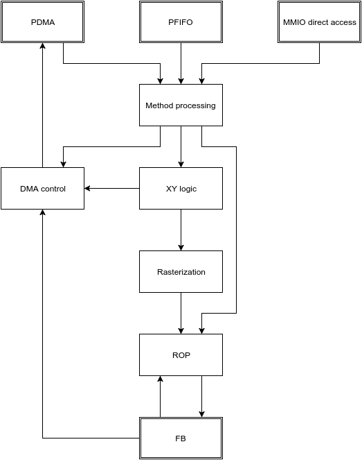

.. _nv1-pgraph:

===========================
NV1 PGRAPH: graphics engine
===========================

.. contents::

Introduction
============

The NV1 includes the first generation of the 2d/3d graphics engine.  It is
capable of performing the following operations:

1. Solid: drawing solid-colored points, lines, triangles, and rectangles;
2. Blit: copying rectangular areas inside a buffer, or between buffers;
3. Image from CPU: drawing a rectangular image with pixel data uploaded
   through the command stream;
4. Bitmap from CPU: drawing a 2-color bitmap with bitmap data
   uploaded through the command stream;
5. Image from memory: drawing a rectangular image with pixel data read
   from a DMA object;
6. Image to memory: downloading a rectangular area from the render buffer
   to a DMA object;
7. Textured quad: drawing a textured linear- or quadratic-interpolated quad
   with texture data uploaded through the command stream, possibly with
   per-vertex lighting.
8. Notification: writing a simple 16-byte structure indicating completion of
   commands so far to a DMA object.

Every drawing operation (that is, all of the above except image to memory) can
be used together with the following operations:

- clipping to a rectangular area,
- per-bitplane write masking,
- color keying,
- one of:

  - blending using the alpha component, or a separate blend factor (aka BETA),
  - bitwise operations using the source color, the destination color, and
    a 64×1, 1×64, or 8×8 repeating 2-color bitmap pattern.

- color format conversion (with dithering) - the supported source formats are:

  - R5G5B5 and A1R5G5B5,
  - R8G8B8 and A8R8G8B8,
  - R10G10B10 and A2R10G10B10,
  - Y8 and A8Y8,
  - Y16 and A16Y16 (though only high 10 bits of Y and 8 bits of A are actually
    used).

The graphics engine has access to one or two buffers in VRAM, managed by
:ref:`PFB <nv1-pfb>`.  The supported formats include:

- 8bpp: indexed Y8,
- 16bpp direct color: D1R5G5B5 (where D is the "DAC LUT bypass" bit),
- 16bpp indexed: D1X7Y8,
- 32bpp direct color: D1X1R10G10B10,
- 32bpp indexed: D1X23Y8.

Classes, objects, and methods
=============================

The graphics engine is operated by submitting so-called methods (ie. commands).
Methods are associated with objects and classes.

A class (ie. object type) is a grouping of related methods that can be used
together to perform an operation - there is one class for every drawing
operation that PGRAPH can perform (as listed above), plus a few classes
setting global parameters that will be used by all drawing operations
(so-called context objects).  In addition to their main function, all classes
can also be used to request a notification.  The classes are identified by
a 5-bit class id and include:

- ``0x01``: :obj:`BETA <nv1-ubeta>`: sets the blending factor,
- ``0x02``: :obj:`ROP <nv1-urop>`: sets the global bitwise operation,
- ``0x03``: :obj:`CHROMA <nv1-uchroma>`: sets the global color key,
- ``0x04``: :obj:`PLANE <nv1-uplane>`: sets the global plane mask,
- ``0x05``: :obj:`CLIP <nv1-uclip>`: sets the global clipping rectangle,
- ``0x06``: :obj:`PATTERN <nv1-upattern>`: sets the global pattern for bitwise
  operations,
- ``0x08``: :obj:`POINT <nv1-upoint>`: draws points,
- ``0x09``: :obj:`LINE <nv1-uline>`: draws solid lines,
- ``0x0a``: :obj:`LIN <nv1-ulin>`: draws solid lins (ie. lines not including
  the final pixel),
- ``0x0b``: :obj:`TRI <nv1-utri>`: draws solid triangles,
- ``0x0c``: :obj:`RECT <nv1-urect>`: draws solid rectangles,
- ``0x0d``: :obj:`TEXLIN <nv1-utexlin>`: draws textured quads with linear
  interpolation,
- ``0x0e``: :obj:`TEXQUAD <nv1-utexquad>`: draws textured quads with quadratic
  interpolation,
- ``0x10``: :obj:`BLIT <nv1-ublit>`: performs blits,
- ``0x11``: :obj:`IFC <nv1-uifc>`: draws rectangular image from CPU,
- ``0x12``: :obj:`BITMAP <nv1-ubitmap>`: draws rectangular bitmap from CPU,
- ``0x13``: :obj:`IFM <nv1-uifm>`: draws rectangular image from memory,
- ``0x14``: :obj:`ITM <nv1-uitm>`: downloads rectangular image from framebuffer
  to memory,
- ``0x1d``: :obj:`TEXLINBETA <nv1-utexlinbeta>`: draws textured quads with
  linear interpolation and per-vertex lighting,
- ``0x1e``: :obj:`TEXQUADBETA <nv1-utexquadbeta>`: draws textured quads with
  quadratic interpolation and per-vertex lighting.

An object is a combination of a class and a set of options determining its
mode of operation.  Object options are a single 16-bit value arranged as
follows:

.. _nv1-pgraph-object:

- bits 0-4: OP - the :ref:`drawing operation to be performed per-pixel
  <nv1-pgraph-rop>`:

  - 0x00: RPOP_DS
  - 0x01: ROP_SDD
  - 0x02: ROP_DSD
  - 0x03: ROP_SSD
  - 0x04: ROP_DDS
  - 0x05: ROP_SDS
  - 0x06: ROP_DSS
  - 0x07: ROP_SSS
  - 0x08: ROP_SSS_ALT
  - 0x09: ROP_PSS
  - 0x0a: ROP_SPS
  - 0x0b: ROP_PPS
  - 0x0c: ROP_SSP
  - 0x0d: ROP_PSP
  - 0x0e: ROP_SPP
  - 0x0f: RPOP_SP
  - 0x10: ROP_DSP
  - 0x11: ROP_SDP
  - 0x12: ROP_DPS
  - 0x13: ROP_PDS
  - 0x14: ROP_SPD
  - 0x15: ROP_PSD
  - 0x17: SRCCOPY
  - 0x18: BLEND_DS_AA
  - 0x19: BLEND_DS_AB
  - 0x1a: BLEND_DS_AIB
  - 0x1b: BLEND_PS_B
  - 0x1c: BLEND_PS_IB

- bit 5: CHROMA - if set, enables the color key
- bit 6: PLANE - if set, enables plane masking
- bit 7: CLIP - if set, enables clipping to the clipping rectangle
- bit 8: NOTIFY_VALID - if set, enables the NOTIFY method
- bits 9-12: COLOR_FORMAT_DST - a composite field that selects the source
  color format and the destination buffer mask:

  -  0: BUF0_A1R5G5B5
  -  1: BUF0_A8R8G8B8
  -  2: BUF0_A2R10G10B10
  -  3: BUF0_A8Y8
  -  4: BUF0_A16Y16
  -  5: BUF1_A1R5G5B5
  -  6: BUF1_A8R8G8B8
  -  7: BUF1_A2R10G10B10
  -  8: BUF1_A8Y8
  -  9: BUF1_A16Y16
  - 10: BUF01_A1R5G5B5
  - 11: BUF01_A8R8G8B8
  - 12: BUF01_A2R10G10B10
  - 13: BUF01_A8Y8
  - 14: BUF01_A16Y16
  - 15: BUF_NONE_A1R5G5B5

- bit 13: ALPHA - enables the alpha channel in source color
- bit 13: SRC_BUF - selects the source buffer for blits (overlaps with
  the above field, since it is unused for blits)
- bit 14: BITMAP_FORMAT - selects the format for bitmap data:

  - 0: LE - pixels are read in order from LSB to MSB of the containing 32-bit
    word
  - 1: CGA6 - in every byte, pixels are read from MSB to LSB; bytes in the
    containing 32-bit word are read from the least significant to most
    significant

- bit 15: SUBCONTEXT_ID - used to implement multiple subcontexts per channel

At all times, the graphics engine has one active object.  The options of the
active object are stored in the :obj:`CTX_SWITCH <nv1-pgraph-ctx-switch>`
register, while its class is stored in the :obj:`ACCESS <nv1-pgraph-access>`
register.

The context objects merely set simple global state, and as such their state
remains valid until it's overwritten by another invocation of their methods.
However, the drawing objects carry a lot of intermediate state between their
methods, known as volatile state.  Whenever the active object is changed,
and a full context switch is not done, its volatile state is lost.  The newly
activated object gets a mostly-clear initial volatile state, which has to be
initialized anew.  Such operation is known as a "volatile reset".

To support multiple concurrent users, the graphics engine has a concept
of "channels", which it shares with :ref:`PFIFO <nv1-pfifo>`.  A 7-bit
channel id is stored in the :obj:`CTX_SWITCH <nv1-pgraph-ctx-switch>`
register.  If, upon an attempt to activate a new object, its channel id
doesn't match the current channel id, the graphics engine halts the
operation (in particular, no volatile reset is performed), and triggers
a hardware interrupt.  The driver is supposed to handle this interrupt
by dumping the current graphics state, loading the graphics state of the new
channel, then resuming graphics operation - thus enabling seamless context
switching.

In addition to channels, which are shared with PFIFO, PGRAPH also has
a similiar concept of subcontexts.  All objects are tagger with a 1-bit
subcontext id.  If the new object's subcontext id doesn't match the current
one, the object switch is likewise halted and the context switch interrupt
is triggered.  This allows the user to have two independent "states" within
a channel.

General operation
=================

Methods are submitted to PGRAPH by writing to the :ref:`method submission MMIO
areas <nv1-pgraph-user>`.  There is one such area for every supported object
class.  Writing an address corresponding to a method will immediately execute
it, and should not be done if a method is currently executing (except in the
special case of IFM data).

The method submission MMIO area can be written (and thus, methods executed)
in three ways:

- directly by the host (which needs to be done while carefully monitoring
  the current status of PGRAPH),
- through :ref:`PFIFO <nv1-pfifo>`: PFIFO queues method invocations and will
  deliver them to PGRAPH when it is not busy, while also taking care of
  automatically submitting object switch commands when needed,
- by the :ref:`PDMA engine <nv1-pdma>`, in response to read requests - this is
  used internally by the :obj:`IFM <nv1-uifm>` class, and it's probably a bad
  idea to attempt it otherwise.

Each of the three ways has a corresponding enable bit in the :obj:`ACCESS
<nv1-pgraph-access>` register.  If such bit is disabled, PDMA and PFIFO will
wait, while host accesses will just be ignored.

Note that it is possible to submit any method of any class, irrespective
of what class is currently active.  However, since a lot of logic in PGRAPH
is controlled by the current active class, submitting using a different class
will usually cause a behavior that is a weird mixture of the intended behaviors
of these classes, and should probably be avoided.

Most methods simply set some state in preparation for a subsequent drawing
operation, and complete immediately.  The remaining methods trigger some
sort of operation involving the PGRAPH's execution units:

- the XY logic unit, responsible for calculating the vertices of drawn
  primitives, and current position in case of IFC/BITMAP/IFM.
- the DMA control unit, sending read/write commands to PDMA and fetching
  framebuffer data for the ITM object.
- the rasterization unit, converting primitives to a series of pixels,
  and sending them to the ROP unit.
- the ROP unit, reading pixels from the framebuffer, performing per-pixel
  operations on them, and writing the results to the framebuffer.

5 different operations are supported:

- 2d draw: draws primitives according to the current object class.  For
  POINT, LIN, LINE, TRI, RECT, and BLIT, the vertex data is sent from
  XY logic to the rasterizer and a single primitive is drawn.  For IFC,
  BITMAP, and IFM, XY logic computes and emits a list of stripes to be
  drawn to the rasterizer.
- 3d draw: draws a few texels of a textured quad.  XY logic computes
  and emits a list of triangles to be drawn to the rasterizer.
- image to memory: DMA control unit asks XY logic to walk through the pixels
  of a rectangle, reads their data from the framebuffer, and sends it to PDMA
  for writing to the DMA object.
- image from memory: DMA control unit submits read requests to PDMA, asking
  it to read from the DMA object and submit the data as payload of special
  draw-triggering methods back to PGRAPH.  The incoming 2d draws from PDMA
  will be executed in parallel with this operation.
- notify: the PDMA unit is asked to write to the notify DMA object.

.. todo:: Lots of speculation here.

MMIO registers
==============

.. space:: 8 nv1-pgraph 0x1000 accelerated drawing engine
   0x080 DEBUG_A nv1-pgraph-debug-a
   0x084 DEBUG_B nv1-pgraph-debug-b
   0x088 DEBUG_C nv1-pgraph-debug-c
   0x100 INTR nv1-pgraph-intr
   0x104 INVALID nv1-pgraph-invalid
   0x140 INTR_EN nv1-pgraph-intr-en
   0x144 INVALID_EN nv1-pgraph-invalid-en
   0x180 CTX_SWITCH nv1-pgraph-ctx-switch
   0x190 CTX_CONTROL nv1-pgraph-ctx-control
   0x400[18] VTX_X_ABS nv1-pgraph-vtx-xy-abs
   0x450 ICLIP_X_ABS nv1-pgraph-iclip-abs
   0x454 ICLIP_Y_ABS nv1-pgraph-iclip-abs
   0x460[2] UCLIP_X_ABS nv1-pgraph-uclip-abs
   0x468[2] UCLIP_Y_ABS nv1-pgraph-uclip-abs
   0x480[18] VTX_Y_ABS nv1-pgraph-vtx-xy-abs
   0x500[18] VTX_X_REL nv1-pgraph-vtx-xy-rel
   0x550 ICLIP_X_REL nv1-pgraph-iclip-rel
   0x554 ICLIP_Y_REL nv1-pgraph-iclip-rel
   0x560[2] UCLIP_X_REL nv1-pgraph-uclip-rel
   0x568[2] UCLIP_Y_REL nv1-pgraph-uclip-rel
   0x580[18] VTX_Y_REL nv1-pgraph-vtx-xy-rel
   0x600[2/8] PATTERN_BITMAP_COLOR nv1-pgraph-pattern-bitmap-color
   0x604[2/8] PATTERN_BITMAP_ALPHA nv1-pgraph-pattern-bitmap-alpha
   0x610[2] PATTERN_BITMAP nv1-pgraph-pattern-bitmap
   0x618 PATTERN_SHAPE nv1-pgraph-pattern-shape
   0x61c[2] BITMAP_COLOR nv1-pgraph-bitmap-color
   0x624 ROP nv1-pgraph-rop
   0x628 PLANE nv1-pgraph-plane
   0x62c CHROMA nv1-pgraph-chroma
   0x630 BETA nv1-pgraph-beta
   0x640 XY_A nv1-pgraph-xy-a
   0x644 XY_B nv1-pgraph-xy-b
   0x648 XY_D_X nv1-pgraph-xy-d
   0x64c XY_D_Y nv1-pgraph-xy-d
   0x650 VALID nv1-pgraph-valid
   0x654 SRC_COLOR nv1-pgraph-src-color
   0x658 SUBDIVIDE nv1-pgraph-subdivide
   0x65c XY_E nv1-pgraph-xy-e
   0x634 CANVAS_CONFIG nv1-pgraph-canvas-config
   0x680 DMA nv1-pgraph-dma
   0x684 NOTIFY nv1-pgraph-notify
   0x688 CANVAS_MIN nv1-pgraph-canvas-min
   0x68c CANVAS_MAX nv1-pgraph-canvas-max
   0x690[2/8] CLIPRECT_MIN nv1-pgraph-cliprect-min
   0x694[2/8] CLIPRECT_MAX nv1-pgraph-cliprect-max
   0x6a0 CLIPRECT_CONFIG nv1-pgraph-cliprect-config
   0x6a4 ACCESS nv1-pgraph-access
   0x6a8 TRAP_ADDR nv1-pgraph-trap-addr
   0x6ac TRAP_DATA nv1-pgraph-trap-data
   0x6b0 STATUS nv1-pgraph-status
   0x700[14] VTX_BETA nv1-pgraph-vtx-beta

Debug registers
---------------

These registers contain assorted flags controlling all sorts of graphics
engine behavior.

.. reg:: 32 nv1-pgraph-debug-a Debug register A

   - bit 0: RESET_TRIGGER - always reads as 0.  Whenever written as 1, resets
     the graphics engine.
   - bit 4: ???
   - bit 8: ???
   - bit 12: ???
   - bit 16: ???
   - bit 20: ???
   - bit 24: ???
   - bit 28: PLANE_ALPHA_ENABLE - if set, the plane mask alpha component will
     be used to discard pixels.  Otherwise, it'll be ignored.

   .. todo:: lots of unknown bits

.. reg:: 32 nv1-pgraph-debug-b Debug register B

   - bit 0: VOLATILE_RESET_LAST - whenever an object switch is performed, this
     is set to 1 if a volatile reset is performed, to 0 otherwise.
   - bit 4: ??? - always reads as 0.
   - bit 8: ???
   - bit 12: ???
   - bit 16: ???
   - bit 20: ???
   - bit 24: ???
   - bit 28: ???
   - bit 29: ???

   .. todo:: lots of unknown bits

.. reg:: 32 nv1-pgraph-debug-c Debug register C

   - bit 0: ???
   - bit 4: ???
   - bit 8: ???
   - bit 12: ???
   - bit 16: ???
   - bit 20: ???
   - bit 24: ???
   - bit 28: ???

   .. todo:: lots of unknown bits

Main control registers
----------------------

.. reg:: 32 nv1-pgraph-ctx-switch Current object and channel

   - bits 0-15: OPTIONS - current object options,
   - bits 16-22: CHID - current channel id (only valid if CHID_VALID
     is set in :obj:`CTX_CONTROL <nv1-pgraph-ctx-control>`,
   - bit 31: VOLATILE_RESET - set if the last object switch involved
     a volatile reset, performs no useful function on its own.

   Any write to this register sets SWITCHING_BUSY in :obj:`CTX_CONTROL
   <nv1-pgraph-ctx-control>` to 0, and VOLATILE_RESET_LAST in :obj:`DEBUG_B
   <nv1-pgraph-debug-b>` to 0 as well.

.. reg:: 32 nv1-pgraph-ctx-control Context control

   - bits 0-1: TIMER_BIT - controls the bit of PTIMER time monitored
     to determine timer expiration.  One of:

     - 0: bit 14 of time is monitored
     - 1: bit 17
     - 2: bit 20
     - 3: bit 23

   - bit 8: TIMER_RUNNING - if set, the channel timeslice timer is running,
     and no channel switches should be done, to ensure a minimum channel
     timeslice.  Otherwise, timeslice timer is expired.  Whenever this is
     set to 1, it will auto-reset to 0 after the PTIMER time bit selected
     by TIMER_BIT changes 3 times.
   - bit 16: CHID_VALID - if set, the current channel id is considered valid.
     If not, it's considered invalid, and activating an object will always
     trigger the context switch interrupt.
   - bit 20: SWITCH_AVAILABLE - read only, tells whether PGRAPH thinks now is
     a reasonable time to switch channels.  Computed as follows:

     - if DEVICE_ENABLED is 0, SWITCH_AVAILABLE is 0.
     - otherwise, if CHID_VALID is 0, SWITCH_AVAILABLE is 1.
     - otherwise, if at least one of SWITCHING_BUSY or TIMER_RUNNING is set,
       SWITCH_AVAILABLE is 0.
     - otherwise, SWITCH_AVAILABLE is 1.

     The value of this bit is exported to PFIFO.

   - bit 24: SWITCHING_BUSY - ???
   - bit 28: DEVICE_ENABLED - ???

   .. todo:: Figure out what all that stuff does.

.. reg:: 32 nv1-pgraph-access Access control and current class

   - bit 0: FIFO - if set to 1, PFIFO is able to write to PGRAPH's MMIO
     registers, ie. can submit methods. If set to 0, PFIFO method
     submission to PGRAPH will be blocked until it's set back to 1.
   - bit 4: DMA - if set to 1, PDMA is able to write to PGRAPH's MMIO registers,
     ie. can respond to DMA read requests. If set to 0, PDMA read data
     will be blocked until it's set back to 1. [XXX: verify]
   - bit 8: HOST - if set to 1, the host is able to write to PGRAPH's MMIO
     registers. If set to 0, writes to all registers in PGRAPH MMIO range
     from host will be ignored, except writes to ACCESS, INTR and INVALID
     registers. Reads to registers other than VTX_POS_* and VTX_BETA_*
     are unaffected.
   - bits 12-16: OBJECT - the type of the current object. Automatically updated
     by PGRAPH when processing method 0. [XXX: what's this for?]
   - bit 24: FIFO_WR - when writing ACCESS and this bit is set to 1 in the
     written value, the FIFO field will be set as per the written value;
     when this bit is set to 0 in the written value, the FIFO field will
     be unaffected. When reading ACCESS, always reads as 1. This, together
     with the following 3 bits, can be used to selectively write ACCESS
     bitfields.
   - bit 25: DMA_WR - like FIFO_WR, but for DMA field
   - bit 26: HOST_WR - like FIFO_WR, but for HOST field
   - bit 27: OBJECT_WR - like FIFO_WR, but for OBJECT field

   Note that the FIFO and HOST bits will be automatically cleared by PGRAPH when
   an interrupt is triggered by execution of a method. The host has to reenable
   HOST access in the interrupt handler to manipulate any PGRAPH state.

The last submitted method can be read from a pair of registers:

.. reg:: 32 nv1-pgraph-trap-addr Last method's address

   This is a read-only register containing the address of the last
   submitted method.

   .. todo:: bitfields

.. reg:: 32 nv1-pgraph-trap-data Last method's data

   This is a read-only register containing the data payload of the last
   submitted method.

The current busy status of PGRAPH can be checked by reading the STATUS
register:

.. reg:: 32 nv1-pgraph-status Busy status of PGRAPH

  A read-only register that can be used to determine what PGRAPH is doing
  at the moment.

  - bit 0: BUSY - PGRAPH is busy processing some method (always set if
    any other bit is set)
  - bit 4: XY_LOGIC - PGRAPH is busy calculating vertex coordinates
  - bit 16: DMA - PGRAPH is busy talking to PDMA about IFM or ITM DMA
  - bit 20: DMA_NOTIFY - PGRAPH is busy talking to PDMA about NOTIFY DMA

  .. todo:: more bits

.. _nv1-pgraph-intr:

Interrupts
----------

The PGRAPH registers dealing with interrupts are:

.. reg:: 32 nv1-pgraph-intr Interrupt status

  Status of interrupts generated by PGRAPH. On read, returns 1 for bits
  corresponding to pending interrupts. On write, if 1 is written to a bit,
  its interrupt gets cleared, if 0 is written nothing happens.

  - bit 0: INVALID - something was wrong with the submitted method. Detailed
    status is available in the INVALID register. Clearing this bit will also
    clear the INVALID register. In turn, clearing the INVALID register will
    clear this bit.
  - bit 4: CONTEXT_SWITCH - a CTX_SWITCH method was submitted and the channel
    id and/or SUBCONTEXT_ID is different from the current one.
  - bit 8: VBLANK - the vertical blanking period has started on PFB. This
    is really PFB's interrupt. It is delivered to a different PMC line than
    other PGRAPH interrupts. See :ref:`NV1 PFB <nv1-pfb>` for details.
  - bit 12: XY_RANGE - an X or Y coordinate used for rendering was out of the
    -0x8000..0x7fff range supported by the rasterizer
  - bit 16: MISSING_METHOD - the final method to do an operation was submitted
    without first submitting other required methods
  - bit 20: CANVAS_SOFTWARE - a drawing operation was attempted with SOFTWARE
    bit set in CANVAS_CONFIG.
  - bit 24: CLIP_SOFTWARE - a drawing operation was attempted with SOFTWARE bit
    set in CLIPRECT_CTRL.
  - bit 28: NOTIFY - a method on which notify interrupt was requested has been
    executed

.. reg:: 32 nv1-pgraph-intr-en Interrupt enable

  Interrupt enable bitmask. Set to enable, clear to disable. Interrupts that
  are masked will still show up in INTR when they're triggered, but won't
  cause the PGRAPH or PFB interrupt line to go active. Has same bitfields
  as INTR.

Interrupts other than VBLANK are delivered to PMC interrupt line 12. VBLANK
interrupt is delivered to PMC interrupt line 24.

The INVALID interrupt is further controlled by these registers:

.. reg:: 32 nv1-pgraph-invalid INVALID interrupt status

  Status of INVALID subinterrupts. Works like INTR. Clearing this register
  will also clear the INVALID bit in INTR register. In turn, clearing INVALID
  bit in INTR will also clear this register.

  - bit 0: INVALID_METHOD - the method that was submitted does not exist
  - bit 4: INVALID_VALUE - the method was submitted with invalid parameter
  - bit 8: INVALID_NOTIFY - a NOTIFY method was submitted, but NOTIFY_VALID
    was not set in graph object options
  - bit 12: DOUBLE_NOTIFY - a NOTIFY method was submitted with NOTIFY_PENDING
    already set
  - bit 16: CTXSW_NOTIFY - a CTX_SWITCH method was submitted with NOTIFY_PENDING
    set

.. reg:: 32 nv1-pgraph-invalid-en INVALID interrupt enable

  INVALID interrupt enable bitmask. Set to enable, clear to disable. Same
  bitfields as INVALID. If any interrupt active in INVALID is also enabled
  here, interrupt line to PMC will be active. Note that this register does
  *not* affect triggering the INVALID bit in INTR and the interrupt status
  from INTR&INTR_EN will be effectively ORed with INVALID&INVALID_EN. Thus
  the contents of INVALID_EN will only matter when INTR_EN.INVALID is set
  to 0.

The INTR and INVALID registers are special and can be written by host even
if ACCESS.HOST is not set.

Note that interrupts that are disabled will still cause PGRAPH to halt and
disable FIFO/HOST bits in ACCESS.

.. _nv1-pgraph-user:

Classes and their methods
-------------------------

.. space:: 8 nv1-ubeta 0x10000 BETA object
   0x0000 OBJECT nv1-mthd-gr-object
   0x0104 NOTIFY nv1-mthd-notify
   0x0300 BETA nv1-mthd-beta

   This class exists only to set the global blending factor, used by objects
   with operation set to BLEND_*.  It uses no special options.

.. space:: 8 nv1-urop 0x10000 ROP object
   0x0000 OBJECT nv1-mthd-gr-object
   0x0104 NOTIFY nv1-mthd-notify
   0x0300 ROP nv1-mthd-rop

   This class exists only to set the global bitwise operation, used by objects
   with operation set to ROP_* and PROP_*.  It uses no special options.

.. space:: 8 nv1-uchroma 0x10000 CHROMA object
   0x0000 OBJECT nv1-mthd-gr-object
   0x0104 NOTIFY nv1-mthd-notify
   0x0304 CHROMA nv1-mthd-chroma

   This class exists only to set the global color key, used by objects
   with CHROMA enabled in their options.  It uses the color format part of
   COLOR_FORMAT_DST option itself.

.. space:: 8 nv1-uplane 0x10000 PLANE object
   0x0000 OBJECT nv1-mthd-gr-object
   0x0104 NOTIFY nv1-mthd-notify
   0x0304 PLANE nv1-mthd-plane

   This class exists only to set the global plane mask, used by objects
   with PLANE enabled in their options.  It uses the color format part of
   COLOR_FORMAT_DST option itself.

.. space:: 8 nv1-uclip 0x10000 CLIP object

   .. todo:: write me

.. space:: 8 nv1-upattern 0x10000 PATTERN object
   0x0000 OBJECT nv1-mthd-gr-object
   0x0104 NOTIFY nv1-mthd-notify
   0x0308 PATTERN_SHAPE nv1-mthd-pattern-shape
   0x0310[2] PATTERN_BITMAP_COLOR nv1-mthd-pattern-bitmap-color
   0x0318[2] PATTERN_BITMAP nv1-mthd-pattern-bitmap

   This class exists only to set the global pattern, used by objects
   with operation set to ROP_*P*, or BLEND_PS_*.  It uses the color format
   part of COLOR_FORMAT_DST option, and the BITMAP_FORMAT option itself.

.. space:: 8 nv1-upoint 0x10000 POINT object

   .. todo:: write me

.. space:: 8 nv1-uline 0x10000 LINE object

   .. todo:: write me

.. space:: 8 nv1-ulin 0x10000 LIN object

   .. todo:: write me

.. space:: 8 nv1-utri 0x10000 TRI object

   .. todo:: write me

.. space:: 8 nv1-urect 0x10000 RECT object

   .. todo:: write me

.. space:: 8 nv1-ublit 0x10000 BLIT object

   .. todo:: write me

.. space:: 8 nv1-uifc 0x10000 IFC object

   .. todo:: write me

.. space:: 8 nv1-ubitmap 0x10000 BITMAP object

   .. todo:: write me

.. space:: 8 nv1-uifm 0x10000 IFM object

   .. todo:: write me

.. space:: 8 nv1-uitm 0x10000 ITM object

   .. todo:: write me

.. space:: 8 nv1-utexlin 0x10000 TEXLIN object

   .. todo:: write me

.. space:: 8 nv1-utexquad 0x10000 TEXQUAD object

   .. todo:: write me

.. space:: 8 nv1-utexlinbeta 0x10000 TEXLINBETA object

   .. todo:: write me

.. space:: 8 nv1-utexquadbeta 0x10000 TEXQUADBETA object

   .. todo:: write me

.. todo:: write me

The object switch method
========================

.. reg:: 32 nv1-mthd-gr-object Object switch

   .. todo:: write me

DMA operation
=============

.. todo:: write me

Context
=======

.. todo:: write me

Surface setup
=============

.. todo:: write me

Drawing operation
=================

.. todo:: write me
