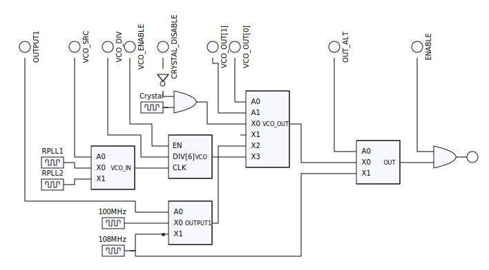

.. _nva3-clock:

================
NVA3:NVC0 clocks
================

.. contents::

.. todo:: write me

Introduction
============

NVA3:NVC0 cards have the following clocks:

- root clocks [RPLL1-2]: used as base for other clocks
- core clock [NVPLL, clock #0/#16]: clocks most of the card's logic
- shader clock [SPLL, clock #1/#17]: clocks the CUDA multiprocessor / shader units
- memory clock [MPLL, clock #2/#18]: used to clock the VRAM, not present on IGPs
- video clock 1 [VPLL1, clock #8/#24]: used to drive the video outputs
- video clock 2 [VPLL2, clock #9/#25]: used to drive the video outputs
- timer clock [TCLK, clock #28]: clocks the PTIMER circuitry
- host clock [HCLK, clock #29]: clocks the host interface parts, like PFIFO
- unknown clock #30
- unknown clock #32
- vdec clock [clock #33]: used to clock the falcon video decoding engines
- unknown clock #36
- daemon clock [clock #37]: used to clock PDAEMON
- audio clock [clock #39]: used to clock PCODEC

.. todo:: figure out unk clocks

The root clocks are set up in PNVIO area, VPLLs are set up in PDISPLAY area,
and the other clocks are set up in PCLOCK area.

.. todo:: write me

MMIO registers
==============

.. space:: 8 nva3-pclock 0x1000 PLL control

   .. todo:: write me

.. space:: 8 nva3-pioclock 0x800 I/O PLL control

   .. todo:: write me

.. space:: 8 nva3-pcontrol 0x1000 misc clock control

   .. todo:: write me

Clock source
---------------

PLL-based clock
--------------------
.. image:: nva3-clk.svg
   :width: 410px
   :alt: PLL-based clock

.. _nva3-clock-tclk:

TCLK: timer clock
=================

.. todo:: write me

.. _nva3-clock-dclk:

DCLK: daemon clock
==================

.. todo:: write me

.. _nva3-clock-vdclk:

VDCLK: video decoding clock
===========================

.. todo:: write me
